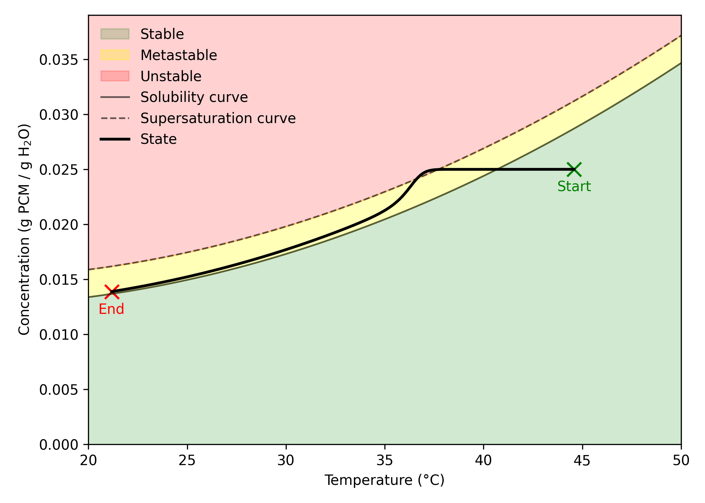

# **acetaminophen-water-cryst**

### **PHSCS 580 — Theory of Predictive Modeling Project**

**State-Space Modeling and Parameter Fitting for Acetaminophen–Water Crystallization**

<p align="center">
  
</p>


## **Overview**

This repository contains the complete workflow for fitting a nonlinear state-space crystallization model to simulated supersaturation and moment-ratio data for the acetaminophen–water system.

Four Jupyter notebooks document the progression from simple least-squares fitting to linearized regression, uncertainty quantification, and a final hybrid parameter-fitting strategy.

The project demonstrates a predictive-modeling pipeline:

**parameter initialization → model simulation → error objective → regression → uncertainty analysis → final calibrated model.**

## **Notebook Guide**

### **1. `method1.ipynb` — Initial Full-Model Fit**

Initial attempt at estimating all model parameters simultaneously using a basic sum-of-squared-errors objective.

### **2. `method2.ipynb` — Normalized Absolute Error Objective**

Improves parameter balance by using a normalized absolute error objective, producing more stable full-model fits.

### **3. `method3_linear.ipynb` — Linear Regression + Cost Surfaces**

Fits nucleation and growth parameters independently using log–log linear regression on
**B(ΔC)** and **G(ΔC)**.

Includes:

* χ²-based uncertainty analysis
* cost surfaces for $(b, k_b)$ and $(g, k_g)$
* confidence ellipses

### **4. `method3_final.ipynb` — Final Hybrid Parameter Fit**

Uses nucleation and growth parameters from `method3_linear`, then fits the remaining final parameter using the `method2` objective.

### **5. `final_figs.ipynb` — Final Report Figures**

Generates solubility diagrams, stability maps, dynamic model plots, and cost-surface figures.

## **Directory Structure**

```
acetaminophen-water-cryst/
│
├── data/         # Raw simulation data used for parameter fitting
├── results/      # Saved outputs from each fitting method
└── figs/         # Figures generated for the final report
```

## **Model Equations**

The nonlinear state-space model is:

$$
\dot{x} = f(x, u, \theta),
\qquad
x = [\mu_0,; \mu_1,; \mu_2,; \mu_3,; C,; T].
$$

Cooling rate input:

$$
u = -\dot{T}.
$$

Parameter vector:

$$
\theta = [k_g,; g,; k_b,; b,; \rho_{\text{cry}} k_v ].
$$

### **Supersaturation**

$$
\Delta C = \max(0,; C - C_{\mathrm{sat}}(T)).
$$

### **Nucleation and Growth Rates**

$$
B(\Delta C) = k_b (\Delta C)^b,
\qquad
G(\Delta C) = k_g (\Delta C)^g.
$$

### **Moment Dynamics**

For $r = 0$:

$$
\dot{\mu}_0 = B
$$

$$
\dot{\mu}_1 = G\mu_0
$$

$$
\dot{\mu}_2 = 2G\mu_1
$$

$$
\dot{\mu}_3 = 3G\mu_2
$$

### **Solute Mass Balance**

$$
\dot{C}
= -\frac{\rho_{\text{cry}} k_v}{\rho_{\text{sol}}}
\left( 3G\mu_2 \right),
\qquad
\rho_{\text{sol}} = 1000\ \text{kg/m}^3.
$$

### **Temperature Dynamics**

$$
\dot{T} = -u.
$$

## **Observation Model**

The measurement function produces:

$$
y = g(x, \theta) =
\begin{bmatrix}
\Delta C \
\mu_1/\mu_0 \
\mu_2/\mu_0 \
\mu_3/\mu_0 \
B(\Delta C) \
G(\Delta C)
\end{bmatrix}.
$$

Outputs correspond to:

* supersaturation
* moment ratios (mean size and higher moments)
* nucleation and growth rate estimates

These are compared against simulation data in the parameter-fitting workflow.

## **Parameter Table**

| Parameter             | Description              | Units                | Notes                               |
|-----------------------|--------------------------|----------------------|-------------------------------------|
| $k_b$                 | Nucleation rate constant | $\text{m}^{-3}\,\text{s}^{-1}$ | In $B = k_b (\Delta C)^b$            |
| $b$                   | Nucleation order         | –                    | Dimensionless                       |
| $k_g$                 | Growth rate constant     | $\text{m}\,\text{s}^{-1}$     | In $G = k_g (\Delta C)^g$            |
| $g$                   | Growth order             | –                    | Dimensionless                       |
| $\rho_{\text{cry}}$   | Crystal density          | $\text{kg}\,\text{m}^{-3}$    | Used with $k_v$                     |
| $k_v$                 | Volume shape factor      | –                    | $\approx 1$ for rectangular prisms  |
| $r$                   | Characteristic radius    | m                    | Fixed at $0$                        |
| $C_{\text{sat}}(T)$   | Solubility curve         | g PCM / g H2O     | Quadratic in $T$                    |
| $u$                   | Cooling rate             | $\text{K}\,\text{s}^{-1}$     | Input to temperature ODE            |
| $\rho_{\text{sol}}$   | Solution density         | $\text{kg}\,\text{m}^{-3}$    | Fixed at $1000$                     |

